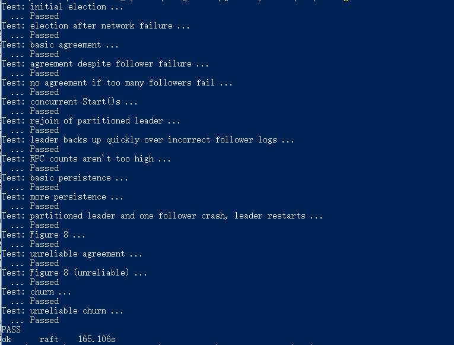

# Raft
can pass all tests.
result as shows:



## build step

- build the GOPATH=$PWD, in linux, you should ```export GOPATH=$PWD```, in windows, you should add a environment variable 'GOPATH' and add the current path to it.

- you can test every test case by run ```go test -run Election```, the Election should be replaced by the test case name. Or test all tests case by run ```go test```
